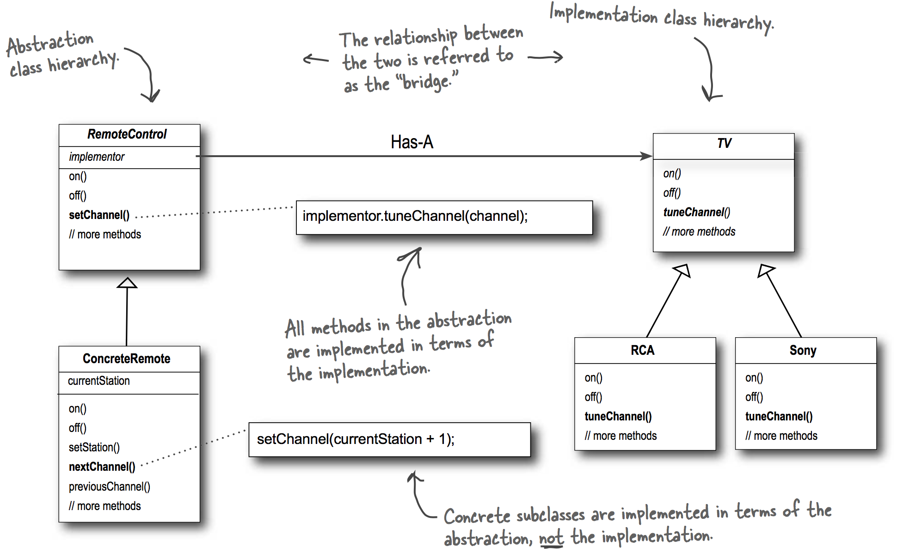

# Bridge (Structural)

> Decouple an abstraction from its implementation so that the two can vary independently

---
## Problem

When an abstraction can have one of several possible implementations, the usual way to accommodate 
them is to use inheritance, but this approach isn't always flexible enough

---
## Solution

---
## Actors

- Abstraction: 
  - Defines the abstraction's interface
  - Maintains a reference to an object of type Implementor
- RefinedAbstraction: Extends the interface defined by Abstraction
- Implementor: 
  - Defines the interface for implementation classes
  - This interface doesn't have to correspond exactly to Abstraction's interface; in fact the two 
  interfaces can be quite different. Typically the Implementor interface provides only primitive operations, 
  and Abstraction defines higher-level operations based on these primitives
- ConcreteImplementor: Implements the Implementor interface and defines its concrete implementation

---
## Applicability

Use the Bridge pattern when:

- You want to avoid a permanent binding between an abstraction and its implementation
- Both the abstractions and their implementations should be extensible by subclassing
- Changes in the implementation of an abstraction should have no impact on clients

---
## Benefits

- Decouples an implementation so that it is not bound permanently to an interface
- Abstraction and implementation can be extended independently
- Changes to the concrete abstraction classes don’t affect the client
